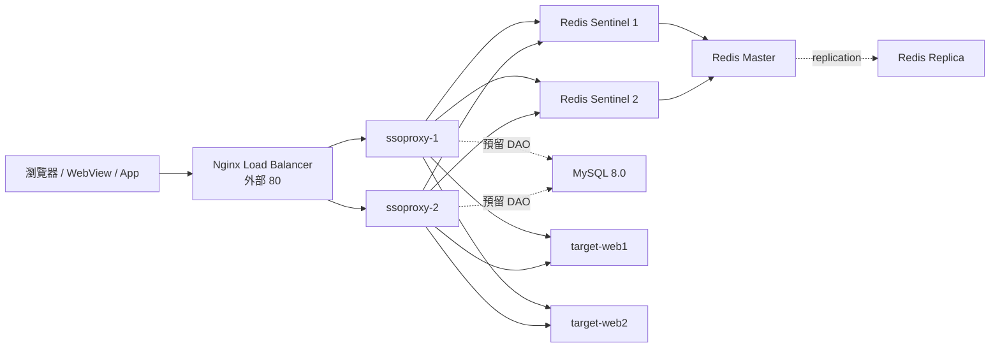
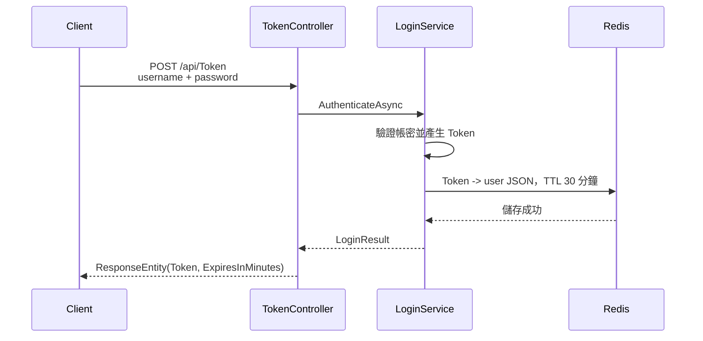
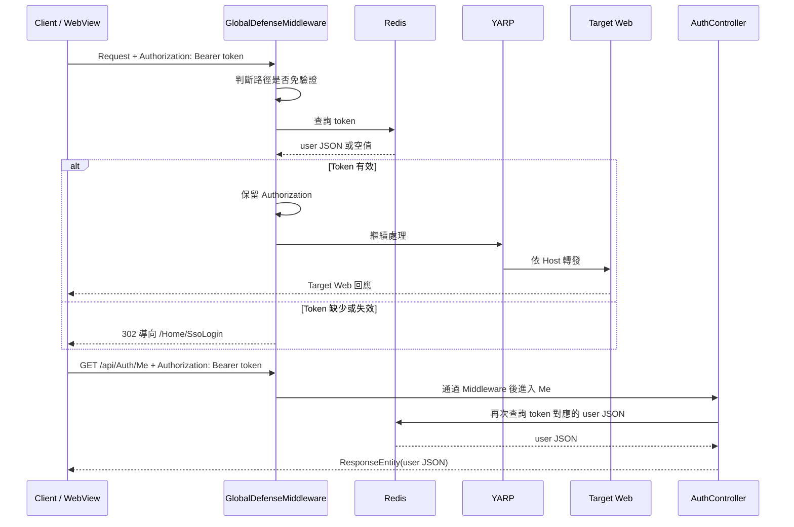

# SSO Proxy

以 .NET 8、Redis Sentinel 與 YARP 建置的 SSO 邊緣代理 PoC。系統在受保護網站前集中處理登入、Token 驗證與請求轉發，Target Web 不需要自行實作完整的登入流程。

> 本文件描述目前原始碼與 Docker Compose 的實際行為。較早期的設計草稿可參考 [ssoproxy/README.md](ssoproxy/README.md)。

## 本次變更範圍

- 以 `sso-poc-nginx` 取代 F5 模擬服務，Nginx 透過主機 `80` 對外提供入口，並以 Round Robin 分流至兩個 Proxy。
- Proxy 僅使用 Docker 內網 `80`，加入 healthcheck，Nginx 會等待兩個 Proxy 就緒後才啟動。
- `test1.gd.com` 與 `test2.gd.com` 分別轉發至 target-web1、target-web2，根路徑與非根路徑都支援。
- MVC 登入路由與 YARP catch-all 路由分離；登入成功後會回到原始目標路徑。
- CSS、JS 與 `/lib/` 靜態資源免登入驗證，不會被 302 導向登入頁。
- 登入 Cookie 設定為 `.gd.com` 共用網域，登入一個 managed domain 後可存取其他 managed domain。
- 補齊 Redis database、路徑驗證與登入 Controller 的 DI 註冊，避免 Proxy 啟動或請求時解析失敗。

## 目錄

- [SA：系統架構](#sa系統架構)
- [SD：軟體設計與請求流程](#sd軟體設計與請求流程)
- [啟動與測試](#啟動與測試)
- [目前限制與注意事項](#目前限制與注意事項)

## SA：系統架構

### 系統定位

`ssoproxy` 是部署在 Docker 內的 ASP.NET Core MVC / Reverse Proxy，主要負責：

1. 提供瀏覽器、WebView 或 App 使用的登入頁與 Token API。
2. 從 Redis 讀取 Token 對應的使用者資訊。
3. 驗證受保護請求的 `Authorization: Bearer <token>`。
4. 驗證成功後保留 `Authorization`，由 `/api/Auth/Me` 取得目前使用者資訊。
5. 透過 YARP 依 Host 將請求轉發到不同的 Target Web。

### 部署拓撲



### 元件與責任

| 元件 | 實作位置 | 責任 |
| --- | --- | --- |
| Web Host 與 DI | [ssoproxy/Program.cs](ssoproxy/Program.cs) | 註冊 MVC、Redis、DAO、服務與 YARP，建立 Middleware pipeline。 |
| 全域防禦 | [GlobalDefenseMiddleware.cs](ssoproxy/Middleware/GlobalDefenseMiddleware.cs) | 判斷免驗證路徑、檢查 Token、保留 Authorization，缺少或失效 Token 時導向登入頁。 |
| 路徑驗證 | [PathValidatorService.cs](ssoproxy/Services/PathValidatorService.cs) | 處理登入路徑與 `SsoWhitelist` Regex 白名單。 |
| 登入服務 | [LoginService.cs](ssoproxy/Services/Auth/LoginService.cs) | 驗證帳密、產生加密格式 Token、將使用者 JSON 寫入 Redis。 |
| Token 服務 | [TokenService.cs](ssoproxy/Services/Auth/TokenService.cs) | 查詢、儲存與刪除 Redis Token。 |
| Redis 連線 | [RedisConnector.cs](ssoproxy/Database/Redis/RedisConnector.cs) | 透過 Sentinel 找尋 Master，並提供連線重試。 |
| API 登入 | [TokenController.cs](ssoproxy/Controllers/TokenController.cs) | 提供 `POST /api/Token`。 |
| 使用者資訊 API | [AuthController.cs](ssoproxy/Controllers/AuthController.cs) | 提供 `GET /api/Auth/Me`，以 Authorization Token 查詢目前使用者資訊。 |
| 網頁登入 | [HomeController.cs](ssoproxy/Controllers/HomeController.cs) | 提供登入頁與表單提交流程。 |
| 反向代理 | YARP 設定於 [appsettings.json](ssoproxy/appsettings.json) | 依 `test1.gd.com` / `test2.gd.com` 選擇 Target Web。 |
| 邊緣入口 | [f5-ltm.conf](f5-config/f5-ltm.conf) | Nginx Load Balancer，對 Proxy 節點做 Round Robin。 |

### Docker Compose 元件

| Service | 角色 | 外部 Port |
| --- | --- | ---: |
| `sso-poc-nginx` | Nginx 唯一對外入口與 Round Robin Load Balancer | `80 -> 80` |
| `sso-poc-proxy1` / `sso-poc-proxy2` | SSO Proxy 雙節點 | 僅 Docker 內網 `80` |
| `sso-poc-redis-master` | Token 狀態主要寫入節點 | 僅內網 |
| `sso-poc-redis-slave` | Redis Replica | 僅內網 |
| `sso-poc-sentinel1` / `sso-poc-sentinel2` | Redis 主節點監控與故障轉移 | 僅內網 |
| `sso-poc-mysql` | SSO 設定資料庫 | `3306 -> 3306` |
| `sso-poc-target-web1` / `sso-poc-target-web2` | 受保護的靜態網站 | `9090 -> 80` / `9091 -> 80` |

所有服務位於 `sso-poc-secure-net`，Compose 定義的子網為 `172.31.254.0/24`。

## SD：軟體設計與請求流程

### 啟動與 Middleware 順序

`Program.cs` 建立的主要處理順序如下：

```text
UseStaticFiles
	-> GlobalDefenseMiddleware
		-> MapControllerRoute（/Home/...）
		-> MapReverseProxy（Host-based catch-all）
```
因此 `wwwroot` 靜態資源會先於全域 Token 驗證處理；登入頁、Token API 與 `/css/`、`/js/`、`/lib/` 靜態資源由 `PathValidatorService` 放行。MVC 只處理 `/Home/...`，根路徑與其他目標路徑交由 YARP 依 Host 分流。

### API 登入與 Token 建立



目前 PoC 的測試帳密由 `LoginService` 直接判斷：`admin / admin123`。成功後 Redis 儲存類似下列使用者資訊：

```json
{
  "Username": "admin",
  "Role": "Admin"
}
```

### 受保護請求與使用者資訊查詢



使用者資訊不應透過 Proxy 注入的自訂 Header 傳遞給 Target Web；Client 應在需要時呼叫 `/api/Auth/Me` 取得目前登入者資訊。

### YARP 路由

| Request Host | Cluster | Target |
| --- | --- | --- |
| `test1.gd.com` | `target-web1-cluster` | `http://sso-poc-target-web1/` |
| `test2.gd.com` | `target-web2-cluster` | `http://sso-poc-target-web2/` |

路由設定位於 [ssoproxy/appsettings.json](ssoproxy/appsettings.json)，Target Web 的根目錄與非根路徑都會依 Host 轉發，例如 `test1.gd.com/targetpage.html` 會到 target-web1，`test2.gd.com/index.html` 會到 target-web2。測試頁面位於 [target-web1/index.html](target-web1/index.html)、[target-web1/targetpage.html](target-web1/targetpage.html) 與 [target-web2/index.html](target-web2/index.html)。

登入成功後設定的 `sso_token` Cookie 使用 `Domain=.gd.com`，因此 `test1.gd.com` 登入後可直接存取 `test2.gd.com`；只有符合設定網域的 Host 才會套用 Domain Cookie，localhost 或其他 Host 仍使用 host-only Cookie。

### 主要端點

| Method | Path | 說明 |
| --- | --- | --- |
| `GET` | `/Home/SsoLogin` | 顯示網頁登入頁。 |
| `POST` | `/Login/SubmitSsoLogin` | 登入表單提交 Action。 |
| `POST` | `/api/Token` | 以 JSON 帳密取得 Token。 |
| `GET` | `/api/Auth/Me` | 使用 `Authorization` Token 取得目前使用者資訊。 |
| `GET/任意` | `test1.gd.com/*` | 經驗證後轉發到 target-web1。 |
| `GET/任意` | `test2.gd.com/*` | 經驗證後轉發到 target-web2。 |

## 啟動與測試

```bash
docker compose up -d --build
docker compose ps
docker compose logs -f sso-poc-proxy1
```

對外入口預設為 `http://localhost`。若使用 Host-based YARP 路由，先將下列網域指向本機：

```text
127.0.0.1 test1.gd.com test2.gd.com
```

API Token 測試範例：

```bash
curl -X POST http://test1.gd.com/api/Token \
  -H 'Content-Type: application/json' \
  -d '{"username":"admin","password":"admin123"}'
```

登入後可測試不同目標路徑：

```bash
curl -H 'Host: test1.gd.com' --cookie 'sso_token=<token>' http://127.0.0.1/targetpage.html
curl -H 'Host: test2.gd.com' --cookie 'sso_token=<token>' http://127.0.0.1/index.html
```

## 目前限制與注意事項

- `LoginService` 目前使用硬編碼測試帳密，正式環境應改接實際身分服務或資料庫。
- `AuthController.Me` 會以 `Authorization` Token 再次查詢 Redis；Target Web 不會收到使用者資訊 Header。
- 登入頁表單統一提交至 `/Login/SubmitSsoLogin`；舊的 `/Home/SubmitSsoLogin` 白名單項目暫時保留以相容既有請求。
- MySQL DAO 已建立，但目前登入流程未使用 `SsoDao` 讀取帳密或 Token 設定。
- 網頁登入與 API 登入成功後都會設定 `sso_token` HttpOnly Cookie，效期與 Token 相同（目前 30 分鐘）；Target Web 透過 `/api/Auth/Me` 取得使用者資訊，不需要讀取 Token。
- 驗證碼由前端產生並透過 Hidden Field 回傳，正式環境應改為伺服器端保存與驗證。
- `Jwe:Secret`、Redis 密碼與 MySQL 密碼目前存在設定檔或 Compose 範例中，正式環境應改用 Secret 管理。
- Compose 中 Nginx upstream 使用 Proxy 服務名稱與容器內 `80` Port；Proxy 不發布主機 Port，外部流量統一由 Nginx 的主機 `80` 入口進入。
- `docker-compose.yml` 的 MySQL 與 Redis 服務沒有對外暴露完整管理介面，預期由同一個 Docker network 內的 Proxy 使用。

## 相關文件

- [ssoproxy/README.md](ssoproxy/README.md)：SSO Proxy 既有系統設計草稿。
- [ssoproxy/appsettings.json](ssoproxy/appsettings.json)：YARP、Redis、MySQL 與白名單設定。
- [docker-compose.yml](docker-compose.yml)：本機 PoC 服務拓撲。
- [database-config/schema.sql](database-config/schema.sql)：資料庫 Schema。
